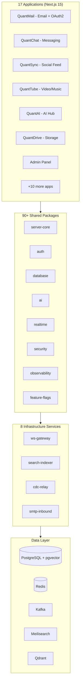

# Quant Ecosystem

[](https://github.com/your-org/Quant-Ecosystem/actions)
[](https://codecov.io/gh/your-org/Quant-Ecosystem)
[](LICENSE)
[](https://www.typescriptlang.org/)
[](https://nodejs.org/)
[](https://pnpm.io/)

A production-grade, interconnected platform of **17 applications**, **90+ shared packages**, and **8 infrastructure services** built as a TypeScript monorepo. Covers email, messaging, social, video streaming, AI, file storage, calendar, video conferencing, and more - all unified by a single authentication layer and shared infrastructure.

## Quick Start

```bash
git clone https://github.com/your-org/Quant-Ecosystem.git && cd Quant-Ecosystem
pnpm install
pnpm dev:all
```

> Requires Node.js 22+, pnpm 10, and Docker for infrastructure services. See [docs/development.md](docs/development.md) for detailed setup.

## Architecture



## Apps

| App               | Description                     | Key Features                                                    |
| ----------------- | ------------------------------- | --------------------------------------------------------------- |
| **QuantMail**     | Email + Central OAuth2 Provider | Full email client, SSO for all ecosystem apps, Git repos, CI/CD |
| **QuantChat**     | Instant Messaging               | Disappearing messages, stories, video calls, smart replies      |
| **QuantSync**     | Social Network                  | Posts, threads, communities, polls, trending topics             |
| **QuantTube**     | Video & Music Streaming         | Upload, live streaming, channels, playlists                     |
| **QuantAI**       | AI Assistant Hub                | Multi-model routing, device control, conversational AI          |
| **QuantDrive**    | Cloud Storage                   | File upload, sharing, versioning, folder management             |
| **QuantDocs**     | Collaborative Documents         | Real-time editing, templates                                    |
| **QuantCalendar** | Calendar & Scheduling           | Events, reminders, meeting scheduling                           |
| **QuantMeet**     | Video Conferencing              | WebRTC, screen sharing, breakout rooms                          |
| **QuantMax**      | Multi-Mode                      | Short videos (TikTok), random chat (Omegle), dating (Tinder)    |
| **QuantEdits**    | Video/Photo Editor              | Timeline editing, effects, exports                              |
| **QuantNeon**     | Photo/Video Sharing             | Filters, stories, close friends                                 |
| **QuantAds**      | Advertising Platform            | Campaign management, targeting, analytics                       |
| **Admin**         | Platform Admin                  | User/service management, audit, compliance, feature flags       |
| **Status**        | Status Page                     | Uptime monitoring, incident reporting                           |
| **Marketing**     | Landing Site                    | Product showcases, pricing                                      |
| **Quant-Mobile**  | Mobile App                      | Cross-platform via Capacitor (iOS + Android)                    |

## Key Packages

| Package                    | Purpose                                                                                               |
| -------------------------- | ----------------------------------------------------------------------------------------------------- |
| `@quant/server-core`       | Fastify 5 app factory with auth, prisma, health, metrics, observability, feature-flags, audit plugins |
| `@quant/auth`              | QuantMail OAuth2 + JWT + session management + PKCE                                                    |
| `@quant/database`          | Prisma schemas and base CRUD model for all domains                                                    |
| `@quant/ai`                | Multi-model AI engine (OpenAI, Anthropic, Meta, Stability)                                            |
| `@quant/realtime`          | WebSocket server/client with presence, channels, delivery guarantees                                  |
| `@quant/security`          | Rate limiting, DDoS, CSRF, XSS, SQL injection, WAF, encryption                                        |
| `@quant/security-advanced` | Double-submit CSRF, IP reputation, session management, field encryption                               |
| `@quant/observability`     | Distributed tracing (OTel), structured logging, metrics, SLO tracking, chaos engineering              |
| `@quant/feature-flags`     | Feature flag service with percentage rollouts and targeting rules                                     |
| `@quant/organizations`     | Multi-tenancy with roles and permissions                                                              |
| `@quant/queue`             | BullMQ job processing with dead letter handling                                                       |
| `@quant/data-pipeline`     | Redis Streams event streaming with analytics/notification/indexing processors                         |
| `@quant/edge-config`       | CDN cache policies, edge middleware, security headers for Next.js                                     |
| `@quant/shared-ui`         | React component library (Button, Modal, ChatBubble, VideoPlayer, etc.)                                |

## Services

| Service             | Purpose                                                          |
| ------------------- | ---------------------------------------------------------------- |
| `ws-gateway`        | WebSocket connection management with JWT auth, presence tracking |
| `search-indexer`    | Kafka CDC event consumer, indexes to Meilisearch + Qdrant        |
| `cdc-relay`         | Change Data Capture from PostgreSQL WAL                          |
| `smtp-inbound`      | Inbound email processing for QuantMail                           |
| `ci-runner`         | CI/CD pipeline execution for QuantMail repos                     |
| `git-server`        | Git hosting backend                                              |
| `matchmaking`       | Real-time user matching (QuantMax)                               |
| `moderation-worker` | AI-powered content moderation pipeline                           |

## Tech Stack

- **Language**: TypeScript (strict mode)
- **Runtime**: Node.js 22+
- **Monorepo**: pnpm 10 workspaces + Turborepo 2
- **Frontend**: Next.js 15, React 19, Tailwind CSS
- **Backend**: Fastify 5 (via server-core), Next.js API routes
- **Database**: PostgreSQL with pgvector extension (Prisma ORM)
- **Cache/Queues**: Redis 7, BullMQ, Redis Streams
- **Messaging**: Kafka (CDC events)
- **Search**: Meilisearch (full-text) + Qdrant (vector/semantic)
- **Real-time**: Custom WebSocket server, WebRTC (QuantMeet/QuantMax)
- **AI**: Multi-model routing (OpenAI, Anthropic, Meta, Stability AI)
- **Observability**: OpenTelemetry, Prometheus, Grafana, Jaeger
- **Deployment**: Docker Compose, Kubernetes (Helm), ArgoCD, Terraform

## Development Commands

```bash
# Install dependencies
pnpm install

# Start infrastructure (PostgreSQL, Redis, Meilisearch, etc.)
docker compose up -d

# Run all apps in development mode
pnpm dev:all

# Type check all packages
pnpm turbo typecheck

# Run tests
pnpm turbo test

# Build everything
pnpm turbo build

# Lint
pnpm turbo lint
```

## Documentation

| Document                                       | Description                                         |
| ---------------------------------------------- | --------------------------------------------------- |
| [Architecture](docs/architecture.md)           | System architecture with Mermaid diagrams           |
| [Deployment](docs/deployment.md)               | Local, Docker, and Kubernetes deployment guides     |
| [API Reference](docs/api-reference.md)         | All backend API endpoints                           |
| [Development](docs/development.md)             | Developer setup, conventions, contribution guide    |
| [Security](docs/security.md)                   | Security architecture, auth flow, incident response |
| [Runbook](docs/runbook.md)                     | Operational procedures, monitoring, troubleshooting |
| [SLOs](docs/slos.md)                           | Service Level Objectives                            |
| [Threat Model](docs/threat-model.md)           | Security threat model                               |
| [Federation](docs/federation.md)               | Federation protocol                                 |
| [Disaster Recovery](docs/disaster-recovery.md) | DR procedures                                       |

## Project Structure

```
Quant-Ecosystem/
├── apps/                    # 17 frontend applications (Next.js 15)
├── packages/               # 90+ shared libraries
├── services/               # 8 infrastructure services
├── infra/                  # Kubernetes (Helm), Terraform, ArgoCD, monitoring
├── docs/                   # Documentation
├── e2e/                    # Playwright end-to-end tests
├── k6/                     # Load testing scripts
├── scripts/                # Build and dev tooling
├── docker-compose.yml      # Full development stack
├── turbo.json              # Turborepo pipeline configuration
├── package.json            # Root workspace configuration
└── tsconfig.json           # Root TypeScript configuration
```

## Authentication

QuantMail serves as the central OAuth2 provider with PKCE support. All ecosystem apps authenticate through it, enabling seamless SSO:

```
User -> Any App -> QuantMail OAuth2 -> JWT issued -> SSO across all apps
```

## License

MIT
