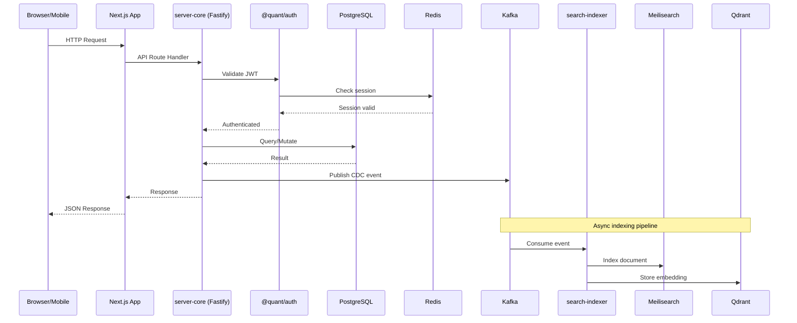
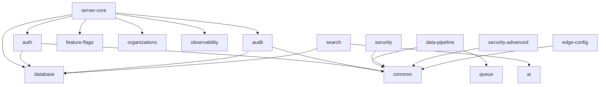

# Quant Ecosystem Architecture

## System Overview

The Quant Ecosystem is a Meta/Google-scale platform comprising 17 frontend applications, 90+ shared packages, and 8 infrastructure services, all built as a TypeScript monorepo using pnpm 10 workspaces and Turborepo 2.

## High-Level Architecture

```mermaid
graph TD
    subgraph Apps["Apps Layer (Next.js 15 Frontends)"]
        A1[quantmail]
        A2[quantchat]
        A3[quantsync]
        A4[quantube]
        A5[quantai]
        A6[quantdrive]
        A7[quantdocs]
        A8[quantcalendar]
        A9[quantmeet]
        A10[quantmax]
        A11[quantedits]
        A12[quantneon]
        A13[quantads]
        A14[admin]
        A15[status]
        A16[marketing]
        A17[quant-mobile]
    end

    subgraph Packages["Packages Layer (Shared Libraries)"]
        P1[server-core]
        P2[auth]
        P3[database]
        P4[ai]
        P5[shared-ui]
        P6[realtime]
        P7[security]
        P8[observability]
        P9[feature-flags]
        P10[organizations]
        P11[queue]
        P12[data-pipeline]
        P13[edge-config]
        P14[security-advanced]
    end

    subgraph Services["Services Layer (Infrastructure)"]
        S1[ws-gateway]
        S2[search-indexer]
        S3[cdc-relay]
        S4[smtp-inbound]
        S5[ci-runner]
        S6[git-server]
        S7[matchmaking]
        S8[moderation-worker]
    end

    subgraph Data["Data Layer"]
        D1[(PostgreSQL + pgvector)]
        D2[(Redis)]
        D3[Kafka]
        D4[Meilisearch]
        D5[Qdrant]
    end

    Apps --> Packages
    Packages --> Services
    Services --> Data
    Apps --> Data
```

## Data Flow Architecture

## Layer Descriptions

### Apps Layer

All applications are Next.js 15 frontends with API routes acting as BFF (Backend for Frontend) layers. Each app communicates with shared packages for business logic and data access.

| App           | Port | Purpose                                                    |
| ------------- | ---- | ---------------------------------------------------------- |
| quantmail     | 3010 | Email client + central OAuth2 provider for all SSO         |
| quantchat     | 3015 | Instant messaging with stories, video calls, smart replies |
| quantai       | 3020 | AI assistant hub with device control                       |
| admin         | 3100 | Platform administration panel                              |
| quantsync     | -    | Social feed (posts, threads, communities)                  |
| quantube      | -    | Video/music streaming platform                             |
| quantdrive    | -    | Cloud file storage and sharing                             |
| quantdocs     | -    | Collaborative document editing                             |
| quantcalendar | -    | Calendar and scheduling                                    |
| quantmeet     | -    | Video conferencing with WebRTC                             |
| quantmax      | -    | Short video + dating + random chat                         |
| quantedits    | -    | Video/photo editor                                         |
| quantneon     | -    | Photo/video sharing                                        |
| quantads      | -    | Advertising platform                                       |
| status        | -    | Service status and uptime monitor                          |
| marketing     | -    | Landing pages and product showcases                        |
| quant-mobile  | -    | Cross-platform mobile (Capacitor)                          |

### Packages Layer

Shared libraries providing core functionality across all applications.

#### Core Infrastructure Packages

| Package         | Purpose                                  | Key Exports                                                 |
| --------------- | ---------------------------------------- | ----------------------------------------------------------- |
| `server-core`   | Fastify 5 app factory with plugin system | `createApp`, auth/prisma/health/metrics plugins             |
| `database`      | Prisma schemas and models                | Schema definitions, base CRUD model                         |
| `auth`          | QuantMail OAuth2 + JWT + sessions        | Token service, session service, middleware                  |
| `queue`         | BullMQ + ioredis job processing          | Queue manager, dead letter handling                         |
| `data-pipeline` | Redis Streams event streaming            | EventStream, processors (analytics, notification, indexing) |
| `realtime`      | WebSocket infrastructure                 | WebSocketServer, channel/presence/delivery managers         |

#### Security & Compliance Packages

| Package             | Purpose                      | Key Exports                                                             |
| ------------------- | ---------------------------- | ----------------------------------------------------------------------- |
| `security`          | Defense-in-depth security    | Rate limiter, DDoS, CSRF, XSS, SQL injection, WAF, encryption           |
| `security-advanced` | Enhanced security controls   | Double-submit CSRF, IP reputation, session management, field encryption |
| `audit`             | Audit logging and compliance | AuditLogger, data export/deletion, retention policies                   |

#### Platform Feature Packages

| Package         | Purpose                  | Key Exports                                            |
| --------------- | ------------------------ | ------------------------------------------------------ |
| `feature-flags` | Feature flag management  | FlagService with percentage rollouts, rules, targeting |
| `organizations` | Multi-tenancy            | Org management, roles, permissions                     |
| `observability` | Full observability stack | Tracer, logger, metrics, circuit breaker, SLO tracking |
| `edge-config`   | CDN/Edge optimization    | Cache policies, edge middleware, security headers      |
| `ai`            | Multi-model AI engine    | Model router, context manager, domain AI services      |
| `shared-ui`     | React component library  | Button, Modal, ChatBubble, VideoPlayer, etc.           |

### Package Dependency Graph

### Services Layer

Infrastructure services running as standalone processes.

| Service             | Port                     | Purpose                                | Technology                       |
| ------------------- | ------------------------ | -------------------------------------- | -------------------------------- |
| `ws-gateway`        | 8080 (WS), 3040 (health) | WebSocket connection management        | @quant/realtime, JWT auth        |
| `search-indexer`    | 3022 (health)            | Kafka CDC events to Meilisearch/Qdrant | KafkaJS, batch embeddings        |
| `cdc-relay`         | -                        | Change Data Capture from PostgreSQL    | Debezium-style WAL reading       |
| `smtp-inbound`      | -                        | Inbound email processing               | SMTP server for QuantMail        |
| `ci-runner`         | -                        | CI/CD pipeline execution               | Job runner for QuantMail repos   |
| `git-server`        | -                        | Git hosting backend                    | Git protocol for QuantMail repos |
| `matchmaking`       | -                        | Real-time user matching                | QuantMax random chat/dating      |
| `moderation-worker` | -                        | Content moderation pipeline            | AI-powered content analysis      |

## Key Design Decisions

1. **Monorepo with workspace protocol**: All internal dependencies use `workspace:*` for consistent versioning and atomic changes across the ecosystem.

2. **QuantMail as OAuth2 hub**: Rather than an external IdP, QuantMail serves as the central identity provider, enabling seamless SSO across all 16 apps.

3. **Fastify 5 with plugin architecture**: `server-core` provides a composable plugin system (auth, prisma, health, metrics, observability, feature-flags, organizations, audit) that all backend services share.

4. **Event-driven indexing**: Database changes flow through Kafka CDC events to the search-indexer, which maintains both full-text (Meilisearch) and vector (Qdrant) indices.

5. **Edge-first optimization**: The `edge-config` package provides CDN cache policies, edge middleware, and security headers that all Next.js apps consume.

6. **Defense-in-depth security**: Two dedicated security packages (`security` and `security-advanced`) provide layered protection from rate limiting to field-level encryption.

7. **OpenTelemetry-native observability**: The `observability` package provides distributed tracing, structured logging, metrics collection, SLO tracking, and chaos engineering tooling.
