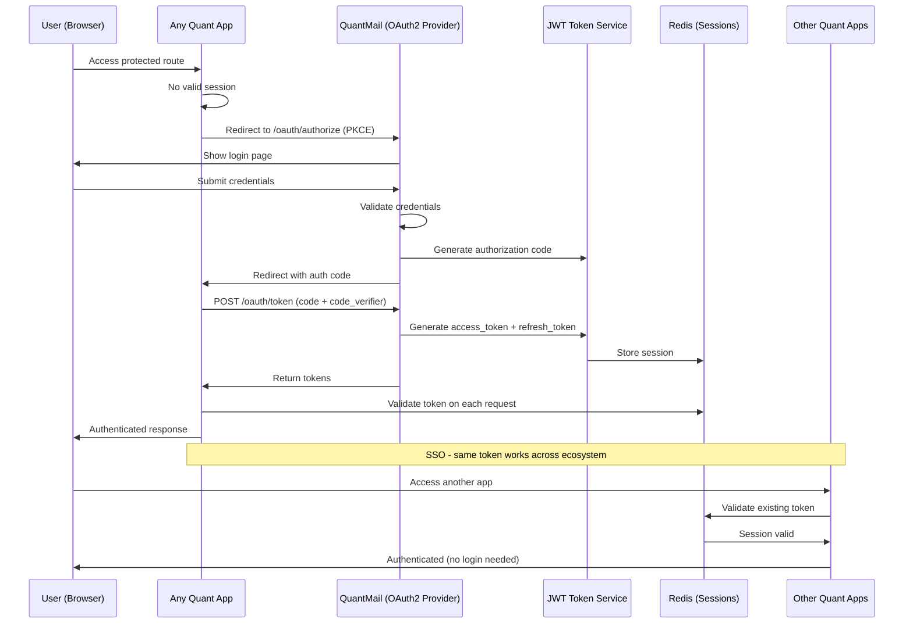
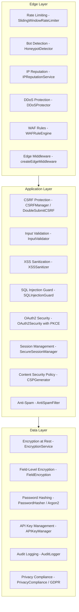

# Security Architecture

## Overview

The Quant Ecosystem implements defense-in-depth security with dedicated security packages (`@quant/security` and `@quant/security-advanced`), centralized OAuth2 authentication via QuantMail, and comprehensive audit logging.

## Authentication Flow



## Defense Layers



## `@quant/security` Package

Located at `packages/security/src/`. Provides core security infrastructure.

### Rate Limiting

```typescript
import { SlidingWindowRateLimiter } from '@quant/security';

const limiter = new SlidingWindowRateLimiter({
  windowMs: 60_000, // 1 minute window
  maxRequests: 100, // max 100 requests per window
});

const result = limiter.check(clientId);
// { allowed: boolean, remaining: number, resetAt: Date }
```

### DDoS Protection

```typescript
import { DDoSProtector } from '@quant/security';

const protector = new DDoSProtector({
  maxRequestsPerSecond: 50,
  blockDurationMs: 300_000, // 5 minute ban
});
```

### CSRF Protection

```typescript
import { CSRFManager } from '@quant/security';

const csrf = new CSRFManager({ secret: process.env.CSRF_SECRET });
const token = csrf.generateToken(sessionId);
const valid = csrf.validateToken(token, sessionId);
```

### XSS Sanitization

```typescript
import { XSSSanitizer } from '@quant/security';

const sanitizer = new XSSSanitizer();
const safe = sanitizer.sanitize(userInput);
// Removes script tags, event handlers, javascript: URLs
```

### SQL Injection Guard

```typescript
import { SQLInjectionGuard } from '@quant/security';

const guard = new SQLInjectionGuard();
const result = guard.analyze(queryString);
// { safe: boolean, threats: SQLThreat[] }
```

### Encryption

```typescript
import { EncryptionService } from '@quant/security';

const encryption = new EncryptionService({ algorithm: 'aes-256-gcm' });
const encrypted = encryption.encrypt(sensitiveData);
const decrypted = encryption.decrypt(encrypted);
```

### API Key Management

```typescript
import { APIKeyManager } from '@quant/security';

const manager = new APIKeyManager();
const key = manager.generate({ scopes: ['read', 'write'], expiresIn: '30d' });
const validation = manager.validate(key.token);
```

### WAF Rule Engine

```typescript
import { WAFRuleEngine } from '@quant/security';

const waf = new WAFRuleEngine();
waf.addRule({ pattern: /union\s+select/i, action: 'block', category: 'sqli' });
const decision = waf.evaluate(request);
// { action: 'allow' | 'block' | 'challenge', rule?: WAFRule }
```

### Additional Security Components

| Class                      | Purpose                                         |
| -------------------------- | ----------------------------------------------- |
| `PasswordHasher`           | Argon2id hashing with configurable parameters   |
| `OAuth2Security`           | OAuth2 flow with PKCE challenge/verification    |
| `AuditLogger`              | Security event logging                          |
| `PrivacyCompliance`        | GDPR data export, deletion, consent management  |
| `IPGeolocation`            | IP-based location lookup for fraud detection    |
| `HoneypotDetector`         | Bot detection via hidden form fields            |
| `SessionSecurity`          | Secure session creation, validation, revocation |
| `CSPGenerator`             | Content Security Policy header generation       |
| `AbuseGraph`               | Sybil attack detection via graph analysis       |
| `ReputationService`        | User trust scoring                              |
| `AntiSpamFilter`           | ML-based spam detection                         |
| `ThreatModeler`            | Automated threat model generation               |
| `PenTestScanner`           | Automated penetration testing                   |
| `APIFuzzer`                | API endpoint fuzzing                            |
| `SecretManager`            | Secure secret storage (vault integration)       |
| `ContainerSecurityScanner` | Docker image vulnerability scanning             |
| `MTLSConfigurator`         | Mutual TLS setup                                |
| `ComplianceFramework`      | SOC2/HIPAA/GDPR compliance checking             |

---

## `@quant/security-advanced` Package

Located at `packages/security-advanced/src/`. Provides enhanced security for production deployments.

### Double-Submit CSRF

```typescript
import { DoubleSubmitCSRF } from '@quant/security-advanced';

const csrf = new DoubleSubmitCSRF({
  cookieName: '__csrf',
  headerName: 'x-csrf-token',
  secret: process.env.CSRF_SECRET,
});

// Server: set cookie + generate token
const pair = csrf.generate(sessionId);
// Client: send token in header, cookie auto-sent
const valid = csrf.validate(cookieValue, headerValue);
```

### IP Reputation Service

```typescript
import { IPReputationService } from '@quant/security-advanced';

const ipRep = new IPReputationService();
ipRep.addRule({ cidr: '192.168.0.0/16', score: -50, reason: 'internal' });

const score = ipRep.evaluate(clientIp);
// { score: number, factors: string[], action: 'allow' | 'challenge' | 'block' }
```

### Secure Session Manager

```typescript
import { SecureSessionManager } from '@quant/security-advanced';

const sessions = new SecureSessionManager({
  maxConcurrentSessions: 5,
  sessionTTL: 3600,
  fingerprintFields: ['userAgent', 'ip', 'acceptLanguage'],
});

const session = sessions.create(userId, fingerprint);
const valid = sessions.validate(sessionId, fingerprint);
sessions.revoke(sessionId);
sessions.revokeAll(userId); // logout everywhere
```

### Field-Level Encryption

```typescript
import { FieldEncryption } from '@quant/security-advanced';

const fieldEnc = new FieldEncryption({
  masterKey: process.env.FIELD_ENCRYPTION_KEY,
  algorithm: 'aes-256-gcm',
});

// Encrypt specific fields before storage
const encrypted = fieldEnc.encrypt('user-ssn', '123-45-6789');
const decrypted = fieldEnc.decrypt('user-ssn', encrypted);
```

### API Key Manager (Advanced)

```typescript
import { APIKeyManager } from '@quant/security-advanced';

const keys = new APIKeyManager({
  prefix: 'qk_',
  hashAlgorithm: 'sha256',
  rotationPeriodDays: 90,
});

const key = keys.create({ scopes: [{ resource: 'emails', actions: ['read'] }] });
const validation = keys.validate(key.token);
```

---

## Encryption Standards

| Context          | Algorithm     | Key Size | Notes                              |
| ---------------- | ------------- | -------- | ---------------------------------- |
| Data at rest     | AES-256-GCM   | 256-bit  | Via EncryptionService              |
| Field-level      | AES-256-GCM   | 256-bit  | Per-field keys via FieldEncryption |
| Password hashing | Argon2id      | -        | Configurable memory/time cost      |
| Token signing    | HMAC-SHA256   | 256-bit  | JWT tokens                         |
| TLS              | TLS 1.3       | -        | All inter-service communication    |
| Key derivation   | PBKDF2/scrypt | -        | For password-derived keys          |

---

## Incident Response Procedures

### Severity Levels

| Level         | Description                                | Response Time | Examples                              |
| ------------- | ------------------------------------------ | ------------- | ------------------------------------- |
| P1 - Critical | Active exploitation, data breach           | < 15 minutes  | SQL injection confirmed, token leak   |
| P2 - High     | Vulnerability discovered, potential breach | < 1 hour      | XSS in production, auth bypass        |
| P3 - Medium   | Security degradation                       | < 4 hours     | Rate limiter misconfigured, audit gap |
| P4 - Low      | Minor security improvement                 | < 24 hours    | CSP violation, outdated dependency    |

### Response Steps

1. **Detect**: Automated alerts from `@quant/observability` + WAF logs
2. **Contain**: Feature flag kill switch to disable affected feature
3. **Assess**: Review audit logs (`@quant/audit`) for scope of impact
4. **Fix**: Apply security patch, rotate affected keys/tokens
5. **Recover**: Verify fix via `PenTestScanner`, restore normal operation
6. **Report**: Generate compliance report via `ComplianceFramework`

### Key Rotation

```bash
# Rotate JWT secret (triggers all session invalidation)
# 1. Generate new secret
# 2. Update in Kubernetes secrets
# 3. Rolling restart all services
# 4. Old tokens invalidated on next validation

# Rotate API keys
# Uses APIKeyManager.rotate() which creates new key and marks old as deprecated
# Deprecation period: 7 days (configurable)
```

### Kill Switches (Feature Flags)

The `@quant/feature-flags` package enables instant disabling of any feature:

```typescript
import { FlagService } from '@quant/feature-flags';

// Emergency: disable OAuth2 for maintenance
await flagService.update('oauth2-enabled', { enabled: false });

// Emergency: force all sessions to re-authenticate
await flagService.update('force-reauth', { enabled: true });
```
